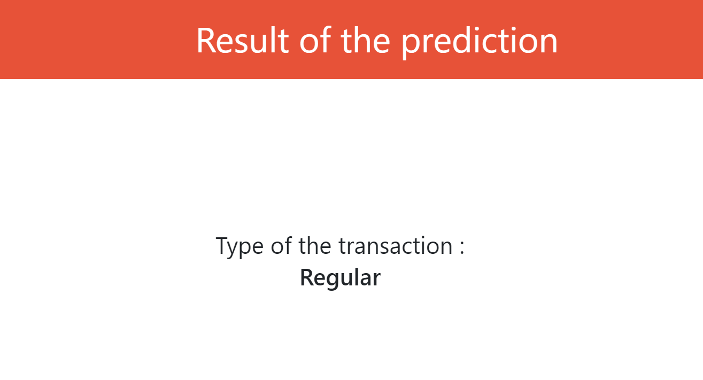

# fraud_detection
Financial Fraud Detection

Created an application using FastAPI to predict if a transaction is fraudulent. The application takes into account the means of transfer (cash-in, cash-out, transfer), and also the amount on the credit and debit accounts after the transactions in order to determine if there is fraud.

For the model, I used a random forest (best model determined after several tests). I then used FastAPI to create the application.

# Prediction example
## Home Page with options to choose (non-fraud case)

## Result of the prediction if there is no fraud

## Home Page with options to choose (fraud case)

## Result of the prediction if there is fraud

